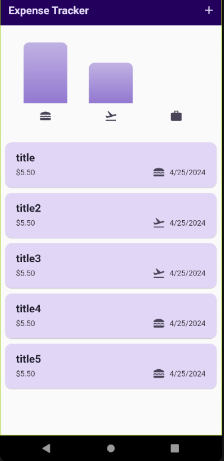
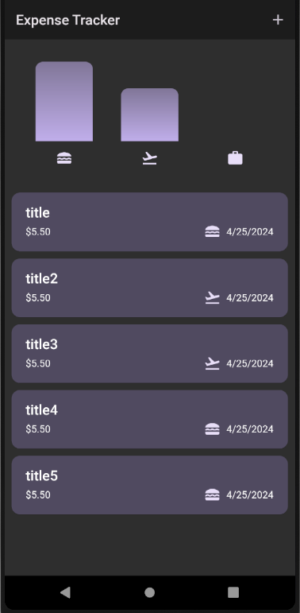
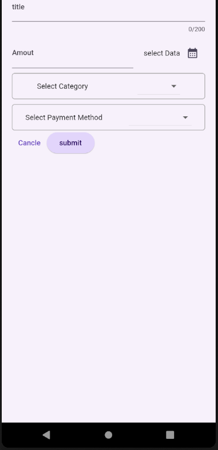
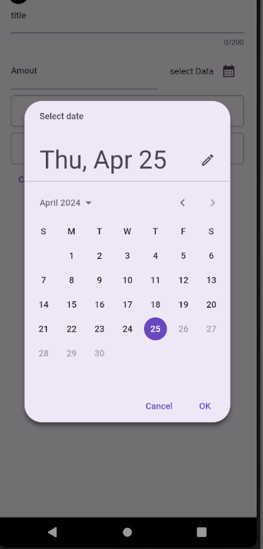

## Expense Tracker

| Home                                            | Dark Mood | Expense input using modal | Date Select |
|---------------------------------------------------------|---------------|---------------|---------------|
|  |  |  |  |

## Flutter features
- Using Modal, Dialogs
- Basic user Input Handling
- Configuring and using app themes

## Feature
- Cart with icon
- List expanse 
- Add expanse
  - Input Filed (Title)
  - Input Filed (Amount)
  - Select Date
- Slide list item (For delete action)